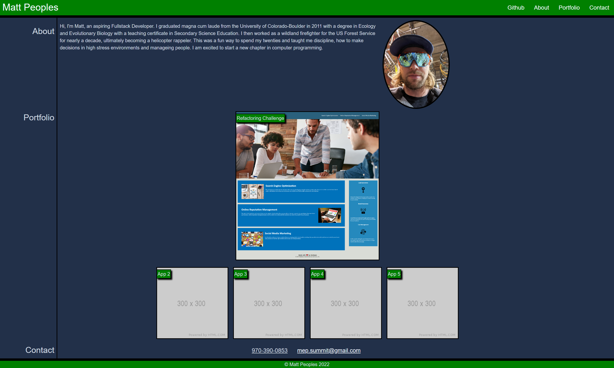

# Matt Peoples's Portfolio

This is the first attempt at making my personal portfolio webpage. The assignment was to create a page where a potential employer can learn a little about me, the projects I have done and how to contact me. This project allowed me to practice many of the new skills I have learned over the past couple weeks and allowed me to really dip my toe in basic web design.

## Skills Practiced

- Media Queries
- Flexbox
- Layout Design
- Creating a responsive layout
- Googling the Unknown
- Positioning using absolute and relative containers
- Debugging Code (Especially CSS)
- Patients and Determination

## Screenshot of Web Page

## Deployment URL

https://peoplesm.github.io/peoples-portfolio/
